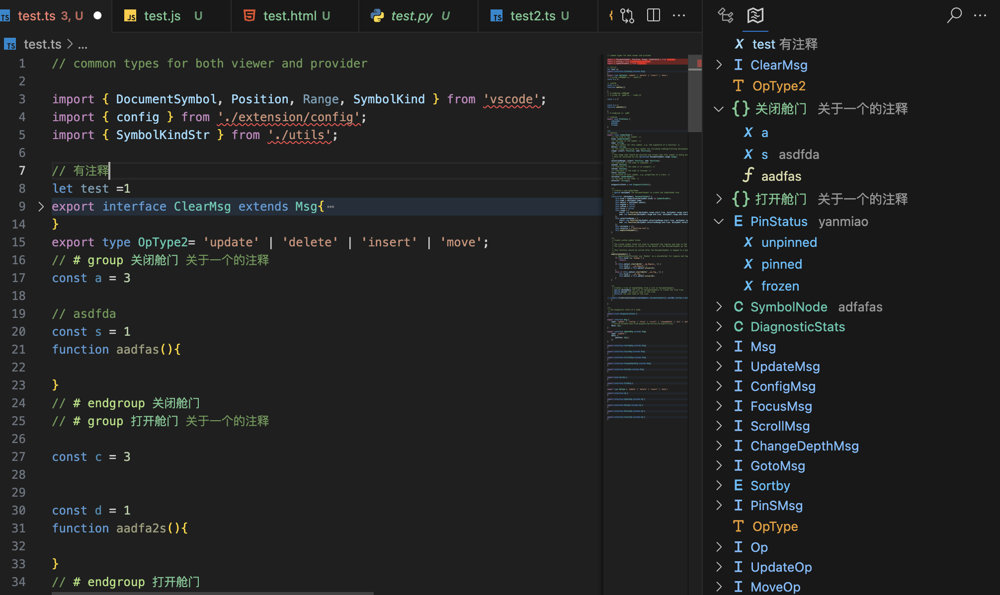
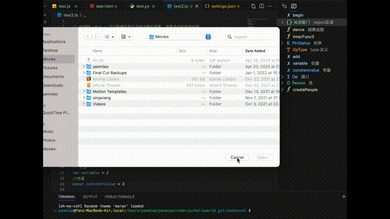

# OutLine Map 插件的fork 修改




修改了图标,颜色和半同步折叠, 插件页面可以 折叠 文档的部分, 增加了 注释功能, 在变量和函数的上方注释会被显示在view界面上,快捷键 ctrl u 可以隐藏和显示没有注释的变量, 变量多的时候很好用,代码很粗糙,赶工出来的临时用下, 用起来没问题就好,有bug可以自己修复下或者提建议也行, 谢谢

## 修改颜色

cmd shift p 打开命令行, 选择 user settings.json , 尾部添加以下配置项

```bash
 "workbench.colorCustomizations": {
        "symbolIcon.om_TagForeground": "#b7fa70",
        "symbolIcon.om_RegionForeground": "#73c991",
        "symbolIcon.functionForeground":"#dcdcaa",
        "symbolIcon.variableForeground":"#9cdcfe",
        "symbolIcon.propertyForeground":"#9cdcfe",
        "symbolIcon.methodForeground":"#dcdcaa",
        // "symbolIcon.interfaceForeground":"#4ec9b0",
        "symbolIcon.enumeratorForeground":"#4fc1ff",
        "symbolIcon.keywordForeground": "#b0e17c",
        "symbolIcon.enumeratorMemberForeground": "#73c991",
        "symbolIcon.classForeground":"#4ec9b0",
        "symbolIcon.constructorForeground":"#569cd6",
        "symbolIcon.constantForeground": "#4fc1ff",
        "symbolIcon.keyForeground": "#ee9d28",
        "symbolIcon.structForeground": "#b7fa70", 
        "symbolIcon": "#ff0000"

    },
    "outline-map.region.startRegion": "# group",
    "outline-map.region.endRegion": "# endgroup",
    "outline-map.region.tag": "# tag",
```

## 插件的使用办法

本地安装

```bash
npm install
npm install -g vsce
npm run package-web
vsce package
```

会生成一个 outline-map-c-1.4.1.vsix 文件

然后 vscode 中 cmd shift p  ,输入  install from VSIX, 添加这个就好
